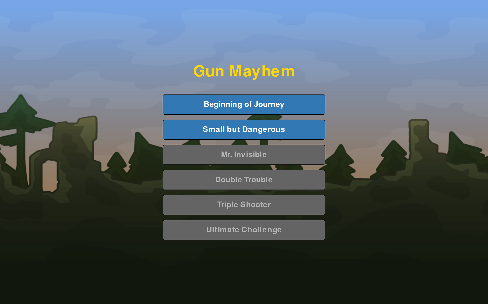
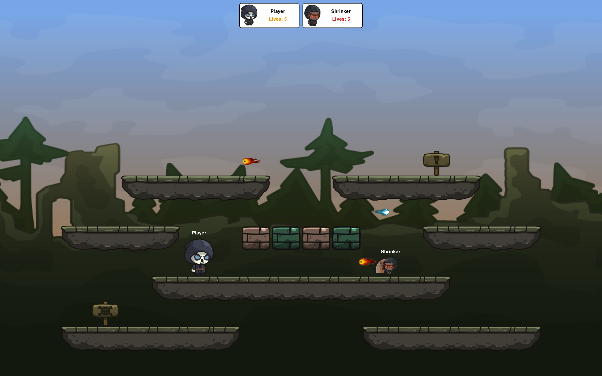

# Gun Mayhem

A 2D action platformer developed in Python using Pygame, inspired by the popular browser game Gun Mayhem. Created
as a school project for Programming in Python course.

---

## 🚀 Installation

1. Clone the repository:
   ```bash
   git clone <repository-url>
   cd Gun-Mayhem
   ```

2. Create and activate a virtual environment:
   - **On Windows:**
     ```bash
     python -m venv .venv
     .\.venv\Scripts\activate
     ```
   - **On Linux/macOS:**
     ```bash
     python3 -m venv .venv
     source .venv/bin/activate
     ```

3. Install the required packages:
   ```bash
   pip install -r requirements.txt
   ```

4. Run the game:
   ```bash
   python main.py
   ```
---

## 🎮 How to Play
  - **WASD/Arrow Keys**: Move player
  - **Space/P**: Shoot
  - **ESC**: Pause game
---

## 🏗️ Project Structure

```
Gun-Mayhem/
├── assets/            # Game assets (images, sounds, maps)
├── src/               
│   ├── constants/     # Game constants (colors, fonts)
│   ├── entities/      # Game entities (player, enemies)
│   ├── enums/         # Enumerations
│   ├── managers/      # Game and level managers
│   ├── model/         # Data models
│   ├── scenes/        # Game scenes (menu, level, pause)
│   ├── ui/            # User interface components
│   ├── utils/         # Utility functions
│   └── weapons/       # Weapon implementations
├── main.py            # Main game entry point
└── requirements.txt   # Python dependencies
```

---


## 🧩 Game Overview

The game loop is implemented in `main.py` and drives the overall execution of the game. The game is organized into three main scenes where each
scene is responsible for its own drawing, updating, and event handling:

- **`MenuScene`** – Displays the main menu with levels.  
- **`LevelScene`** – Core gameplay scene that loads level data, creates entities, and handles level progression.  
- **`PauseScene`** – Activated during gameplay to display the pause menu and allow the player to resume or quit.

All game characters inherit from a common base class, `Entity`, which defines shared behavior such as movement, collision, and interaction. 
Entities have assigned weapons, allowing them to shoot using customizable logic. The game includes various enemy types, such as the standard base enemy, 
**Shrinker** (a smaller, agile enemy), **Invisible** (hard to detect), and **Triple** (equipped with a weapon that fires three bullets simultaneously).

---

## 🧱 Design Principles

The codebase is designed with **high cohesion** and **loose coupling** in mind. Each module has a clear responsibility, which makes the project easier to understand, maintain, and extend. This modular approach ensures that new features or changes can be introduced with minimal impact on the existing code.

---


## 🧪 Testing

The game was manually tested by playing through all levels on various screen resolutions
and setups to ensure smooth gameplay and UI scaling. 

### Tested On:
- WQXGA (2560x1600)
- Full HD (1920x1080)

---


## 📸 Screenshots

### Menu scene


### Level scene



